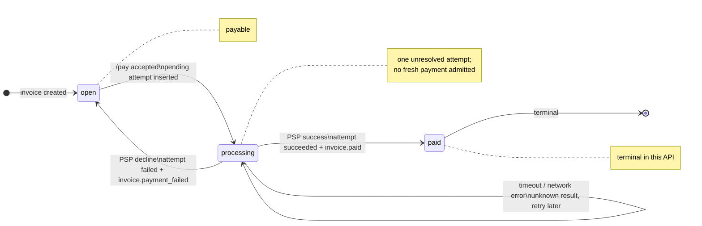

# Invoice & Payment Service Design

This service has one narrow responsibility: create invoices, accept payment attempts, reconcile a mock PSP result, and deliver invoice webhooks. PostgreSQL is both the source of truth and the durable work queue.

## 1. Data Model

| Table | Shape, indexes, and key strategy | Reasoning and 100x changes |
| --- | --- | --- |
| `businesses` | UUID PK, `name` | Ownership root for all tenant data. At 100x, keep UUIDs and add operational metadata only when needed. |
| `api_keys` | SHA-256 key hash PK, business FK, nullable `revoked_at` | Raw API keys are not stored. Hash PK gives direct auth lookup. At 100x, add key prefixes for operator lookup and managed secret rotation. |
| `customers` | UUID PK, `business_id`, `name`, `email`, `created_at`; unique `(business_id,id)`; index `(business_id,created_at,id)` | Email is contact data, not identity. Composite uniqueness supports tenant-safe FKs. At 100x, move offset pagination to cursor pagination. |
| `invoices` | UUID PK, business/customer FK, JSONB `line_items`, bigint `total_cents`, `state`, `due_date`, `created_at`; index `(business_id,state,created_at,id)` | Items are immutable and always returned with the invoice, so JSONB avoids an unused join table. Money is integer cents. At 100x, normalize line items only if reporting/search needs it. |
| `payment_attempts` | UUID PK, business/invoice FK, `idempotency_key`, `request_hash`, `card_token`, saved `response`, `status`, `psp_ref`, `failure_code`, `retries`, `next_run`; unique `(business_id,idempotency_key)`; partial unique index one pending attempt per invoice; pending-job index on `next_run` | This table is both payment history and worker queue. The partial unique index prevents two unresolved charges for one invoice. At 100x, add bounded worker concurrency, queue-lag metrics, and retention/archive policy. |
| `webhook_endpoints` | UUID PK, business FK/index, URL, secret | Each endpoint has its own signing secret. At 100x, encrypt secrets and add endpoint status controls. |
| `webhook_deliveries` | UUID PK, endpoint FK, exact payload text, attempts, `next_run`, delivered/exhausted timestamps, last status; pending index on `next_run` | Transactional outbox. Delivery work is committed with invoice state changes. At 100x, archive delivered rows and add replay tooling. |
| `mock_psp.charges` | Attempt UUID PK, request, stable response, `ready_at`, call count | Simulates a PSP idempotency ledger. It shares local Postgres only for setup; the invoice service reaches it over HTTP. In production this is an external PSP guarantee. |

Application-created rows use random UUIDs, avoiding sequence coordination and making public IDs hard to guess; the local bootstrap business uses a fixed demo UUID. Composite foreign keys keep customers, invoices, and attempts inside the same business. Amounts use checked `i64` math and bigint storage.

## 2. Invoice State Machine

`open` means payable. `processing` means exactly one unresolved payment attempt exists. `paid` is terminal.

Only `processing -> open` is reversible, and only after a confirmed PSP decline such as `card_declined` or `insufficient_funds`. `processing -> paid` is not reversible in this API; refunds would need a separate ledger and PSP operation. Invalid transitions are rejected in `/pay`: a fresh payment on `processing` or `paid` returns `409 invalid_invoice_state`. An exact idempotent replay still returns the original saved `202` receipt.

The deliberate choice is that timeout and network error do not transition the invoice. Unknown processor state stays `processing`, because reopening could allow a second charge while the first may still succeed.

## 3. Payment Correctness & Failure Modes

Every accepted `/pay` returns a durable `202` receipt with a status URL. The API admits work; the worker completes it.

**(a) Two simultaneous `/pay` calls.** Payment admission uses a row-level lock: `SELECT ... FOR UPDATE` on the business-scoped invoice. The first transaction that sees `open` inserts a pending attempt and sets the invoice to `processing`. A competing request with a different key later sees `processing` and gets `409`. A competing exact replay with the same key returns the saved receipt. The partial unique index on one pending attempt per invoice is a second database guard. Row locking is enough because the invoice row is the contention boundary; serializable isolation would add retry complexity, and advisory locks would duplicate the invoice identity.

**(b) `tok_timeout`.** The endpoint returns `202` promptly. The worker HTTP timeout is two seconds, while the mock PSP makes `tok_timeout` success available after about 30 seconds. Until a clear result is recovered, `payment_attempts.status` remains `pending` and `invoices.state` remains `processing`. Retries use backoff of 2, 4, 8, 16, then 30 seconds capped. The caller learns the result by polling `GET /invoices/{id}` or receiving `invoice.paid`.

**(c) PSP success then service crash before persisting.** The attempt is committed before the PSP call, and every PSP call uses the attempt UUID as idempotency key. If the service loses the success response, a later retry asks the PSP for the same charge and receives the same stored success. The customer is not charged twice as long as the PSP honors idempotency. Finalization conditionally updates only a `pending` attempt, so duplicate workers cannot emit duplicate final events.

**(d) Idempotency key reused with changed body.** The request hash covers invoice ID and parsed card token. Same business/key with a different valid request returns `409 idempotency_key_reused`. JSON whitespace does not matter; unknown fields are rejected before admission.

**(e) Paid invoice receives `/pay`.** A fresh key returns `409 invalid_invoice_state`. The original key and same body replay the original `202` receipt without another PSP call.

## 4. Webhook Design

Invoice creation and payment finalization call `enqueue_event` inside the same transaction as the invoice state change. That inserts one `webhook_deliveries` row per endpoint registered at that time. The API does not send webhooks inline; endpoint latency or failure cannot delay the API response or roll back a payment.

Each delivery is signed with HMAC-SHA256 over `timestamp + "." + exact_body_bytes`. Headers are `Webhook-Timestamp: <unix-seconds>` and `Webhook-Signature: v1=<hex>`. Receivers reject timestamps outside five minutes and should deduplicate by event ID. The demo receiver verifies the signature and logs `verified demo webhook`.

Retry policy: six total sends: immediate, then 5, 30, 120, 600, and 1,800 seconds. Each HTTP request has a two-second timeout and redirects are disabled. Non-2xx and transport errors retry. After six failed sends, the row is marked exhausted with `last_status`. Businesses reconcile missed events by listing invoices or calling `GET /invoices/{id}`, which includes payment attempts. Operator SQL can inspect exhausted delivery rows; no replay API is included.

## 5. API Key Model

Local Compose seeds one development-only business key. The raw key is provided through `BOOTSTRAP_API_KEY`, hashed with SHA-256, and stored as `api_keys.key_hash`. Requests transmit it as `Authorization: Bearer <key>`.

Production keys should be 32 random bytes or more, shown once to the business, and stored only as hashes. Rotation means insert a new key hash for the same business, deploy it to the client, then set `revoked_at` on the old key. Authentication checks `revoked_at IS NULL` on every request. A leaked key can access only one business's records and permitted writes, not other tenants. Production must use TLS; local Compose is HTTP only.

## 6. What Was Cut and Why

- Invoice editing/cancellation: would require extra states and conflict rules not requested.
- Refunds/partial payments: need a ledger and PSP operations; not a `paid -> open` transition.
- Broker or separate worker service: Postgres already gives durable scheduling for this scope.
- Webhook replay API/dashboard: rows are retained for inspection; current-state reconciliation is available through invoice APIs.
- Tax, FX, subscriptions, dunning: product domains outside the core payment-correctness problem.

## 7. Production Readiness Gap

1. Observability and operations: queue-lag metrics, alerts for old pending attempts, retry dashboards, and operator reconciliation tools.
2. Security hardening: HTTPS, managed secrets, encrypted webhook secrets, separate database roles, and webhook egress controls to reduce SSRF risk.
3. Abuse and audit controls: rate limits, per-business quotas, audit logs for state-changing actions, retention policy, and backup/restore drills.
